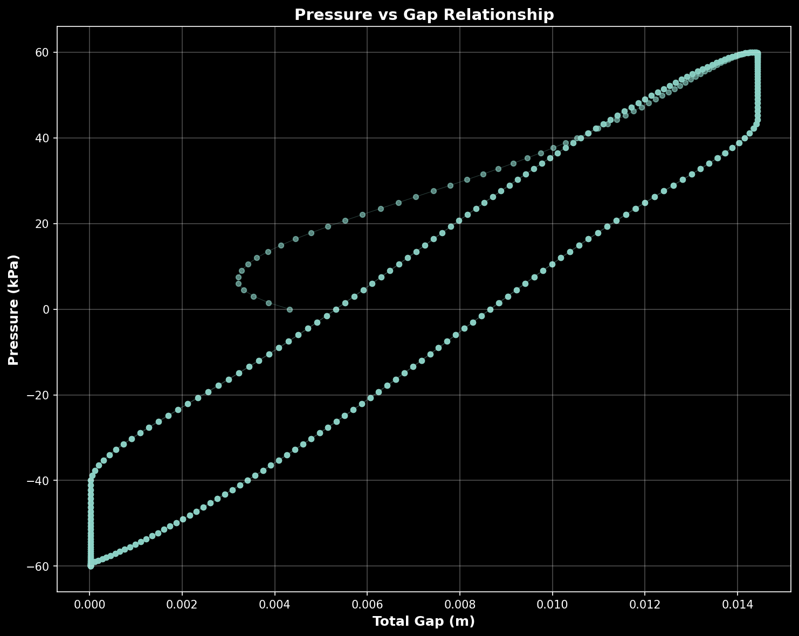
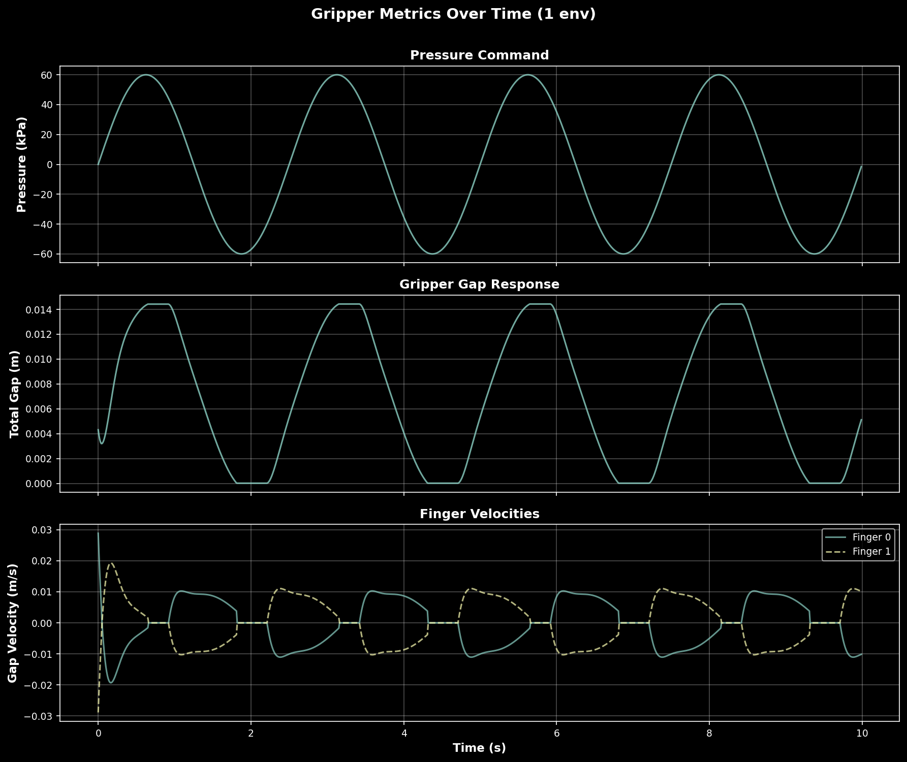

# Electron Pneumatic Gripper Demo

A demonstration of pressure-based control for a pneumatic gripper using Isaac Lab, showcasing how to extend the `Articulation` class with custom control strategies.

## Overview

This project demonstrates how to create **custom robot controllers** in Isaac Lab by extending the base `Articulation` class. The Electron Pneumatic Gripper implements pressure-to-force mapping with compliant PD control, serving as a reference implementation for:

- Pneumatic/hydraulic actuator simulation
- Force-based control strategies
- Contact-rich manipulation tasks
- Custom control laws (impedance, admittance, model-based)

## Project Structure

```
GimbalLock/
├── src/                    # Source code modules
│   ├── gripper.py          # Custom Gripper class extending Articulation
│   ├── gripper_cfg.py      # Configuration with PD gains and pressure mapping
│   ├── gripper_logger.py   # Gripper-specific data logging and plotting
│   ├── camera.py           # Camera utilities for video/image capture
│   └── joint_logger.py     # Joint data logging and plotting
├── scripts/                # Executable scripts
│   ├── model.py            # Generate URDF/MJCF from Onshape URL
│   ├── export_usd.py       # Convert URDF to USD format
│   ├── sim_day0.py         # Basic position control demo (baseline)
│   └── sim_day1.py         # Pressure control demo (custom controller)
├── models/gripper/         # Robot model assets (URDF, USD, MJCF, meshes)
├── media/                  # Documentation media (videos, images)
├── output/                 # Simulation outputs (videos, plots)
└── requirements.txt        # Python dependencies
```

## Workflow

### 1. Generate Robot Models from Onshape

Convert an Onshape assembly to URDF and MJCF formats:

```bash
python scripts/model.py <onshape_url>
```

This generates:
- URDF: `models/gripper/urdf/robot.urdf`
- MJCF: `models/gripper/mjcf/robot.xml`
- Mesh assets: `models/gripper/assets/`

### 2. Convert URDF to USD

Prepare the model for Isaac Lab simulation:

```bash
python scripts/export_usd.py
```

Outputs USD file to `models/gripper/usd/robot.usd`

### 3. Run Simulations

**Basic Position Control (Baseline):**
```bash
python scripts/sim_day0.py --num_envs 1
```
Uses raw `Articulation` class with position control, toggling between joint limits.

**Pressure Control (Custom Controller):**
```bash
python scripts/sim_day1.py --num_envs 1
```
Uses custom `Gripper` class with sine wave pressure control (-60 to +60 kPa, 2.5s period).

**Outputs:**
- `gripper_pressure_gap.png` - Pressure vs gap validation plot
- `gripper_time_series.png` - Time-series of pressure, gap, and velocities

**Optional video recording:**
```bash
python scripts/sim_day1.py --num_envs 1 --enable_cameras
```
Additional output: `gripper_pressure_demo.mp4` (30 FPS)

## Demo Results

### Simulation Video

Gripper responding to sinusoidal pressure commands (-60 to +60 kPa, 2.5s period):

https://github.com/user-attachments/assets/gripper_pressure_demo.mp4

*Note: If video doesn't display, see `media/gripper_pressure_demo.mp4`*

### Pressure-Gap Relationship

The scatter plot validates the pressure-to-gap mapping and reveals hysteresis in the control system:



The smooth curve shows the gripper following the sine wave pressure command, with the hysteresis loop indicating dynamic response characteristics.

### Time-Series Analysis

Detailed view of pressure commands, gap response, and finger velocities:



**Top**: Sine wave pressure command  
**Middle**: Smooth gripper gap response with slight lag  
**Bottom**: Per-finger velocities showing symmetric behavior

## How It Works

### Custom Gripper Controller

The `Gripper` class extends Isaac Lab's `Articulation` to add pressure-based control:

**Key Design Pattern:**
```python
class Gripper(Articulation):
    def write_data_to_sim(self):
        # 1. Compute current gap from finger positions
        gap = self._compute_gap()
        gap_velocity = self._compute_gap_velocity()
        
        # 2. Map pressure → target gap
        target_gap = self._compute_gap_target(self._target_pressure)
        
        # 3. PD control: force = kp*(target - current) - kd*velocity
        force = self._kp * (target_gap - gap) - self._kd * gap_velocity
        
        # 4. Write forces directly to PhysX
        self.root_physx_view.set_dof_actuation_forces(force, ...)
```

**Control Flow:**
1. User calls `gripper.set_pressure(pressure)` → stores target pressure
2. Scene calls `gripper.write_data_to_sim()` → computes and applies forces
3. Simulation steps with applied forces
4. Scene calls `gripper.update(dt)` → reads new state from PhysX

**Technical Highlights:**
- Zero-stiffness actuators to disable built-in PD control
- Geometric gap computation using quaternion rotations
- Linear pressure-to-gap mapping fitted on-the-fly
- Per-finger force control with symmetric gap targets

### Extending Articulation

The gripper demonstrates key inheritance patterns:

- **Inherit:** Joint/body state management, PhysX interfacing
- **Add:** Pressure control API (`set_pressure()`)
- **Override:** Force computation (`write_data_to_sim()`)
- **Leverage:** Parent utilities (`find_bodies()`, `write_joint_*_to_sim()`)

This pattern allows full control over the control law while reusing Isaac Lab's robust state management infrastructure.

### Known Deficiencies

- **Pressure-to-gap mapping overhead**: The linear fit (`gap = m*pressure + b`) is recomputed every control step in `_compute_gap_target()`. This should be cached during initialization to avoid redundant least-squares computation in the hot path.

- **Finger velocity in world frame**: Gap velocity is computed by projecting finger velocities onto the world-transformed y-axis. This should be done in the gripper's local frame for better numerical stability and to avoid coupling with root body motion.

- **Multi-environment gap computation**: The `_compute_gap()` method uses `.unsqueeze(0)` on the projection axis, which breaks when using multiple environments. Should broadcast correctly to `[num_envs, 3]` shape for proper multi-environment support.

## EC2 Workflow

For running simulations on AWS EC2 with DCV (NICE DCV remote desktop):

### Setup
- [Installing Linux Prerequisites](https://docs.aws.amazon.com/dcv/latest/adminguide/setting-up-installing-linux-prereq.html)
- [Installing DCV Server on Linux](https://docs.aws.amazon.com/dcv/latest/adminguide/setting-up-installing-linux-server.html)

### Start DCV Session

```bash
sudo dcv create-session my-console-session --type=console --owner ubuntu
dcv list-sessions
```

Connect via browser at `https://<ec2-ip>:<port>` to access the virtual Ubuntu desktop.

## Development Environment

This project runs inside Isaac Lab's devcontainer, which provides a complete Isaac Sim + Isaac Lab environment with all dependencies pre-configured (PyTorch, CUDA, USD libraries, and robotics tools).

**Prerequisites:**
- Docker Desktop
- VS Code with [Dev Containers extension](https://marketplace.visualstudio.com/items?itemName=ms-vscode-remote.remote-containers)
- NVIDIA GPU with updated drivers (for physics simulation)

Clone this project into Isaac Lab's `source/` directory and use the Isaac Lab devcontainer for seamless development. The container handles all complex dependencies—just open and code.
